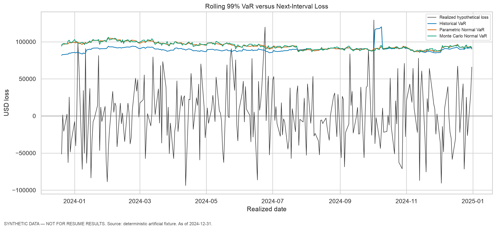
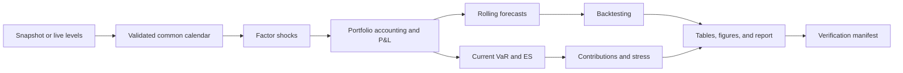

# Multi-Asset Market Risk Engine

[](https://github.com/sheeeeshba/market-risk-engine/actions/workflows/tests.yml)
[](https://www.python.org/)
[](LICENSE)
[](https://colab.research.google.com/github/sheeeeshba/market-risk-engine/blob/main/notebooks/market_risk_engine_colab.ipynb)

A Python market-risk engine that converts a multi-asset portfolio into daily P&L, one-interval VaR and Expected Shortfall forecasts, backtesting diagnostics, scenario losses, risk contributions, and an automated management report.

> **Evidence status:** the repository includes a deterministic synthetic snapshot so every reviewer can reproduce the complete pipeline without credentials. Generated values are implementation evidence, not historical-market or portfolio-performance claims. Optional live-data adapters are included separately.



## Key Capabilities

- Canonical USD 10 million funded portfolio plus a separately accounted long-EUR overlay.
- Adjusted-return ETF P&L, duration-convexity bond P&L, direct EURUSD P&L, monthly self-financing rebalancing, and daily NAV reconciliation.
- Historical Simulation, linear Parametric Normal, and full-revaluation Monte Carlo VaR/ES at 95%, 97.5%, and 99%.
- Exact finite-sample Historical ES weights, including equal treatment of scenarios tied at the VaR boundary.
- Leak-free rolling 99% forecasts with Kupiec and Christoffersen tests and explicit low-power warnings.
- Position, asset-class, and factor risk views; additive Parametric component VaR and Historical ES contributions.
- Six hypothetical scenarios, three versioned artificial crisis-replay fixtures, and volatility/correlation distribution stress.
- Versioned Markdown report, eight figures, CSV evidence tables, configuration hash, snapshot hash, and verification manifest.

## Portfolio and Data

Funded target weights are SPY 20%, QQQ 10%, EFA 10%, GLD 5%, US 5Y bond 15%, US 10Y bond 15%, and USD cash 25%. They sum to 100% of NAV. A long-EUR/short-USD overlay has zero funded market value and a risk notional equal to 7.5% of post-rebalance NAV.

The repository includes a fixed 520-row artificial factor snapshot for offline engineering verification. Optional live mode downloads ETF and EURUSD levels through `yfinance` and DGS5/DGS10 observations from FRED, then rebuilds the common calendar. Provider data are not bundled as a verified real-data snapshot.

## Concise Methodology

- Positive P&L is profit; loss is `-P&L`; VaR and ES are reported as loss magnitudes.
- ETF P&L is signed book market value times adjusted simple return.
- Bond return is `-Modified Duration × ΔYield + 0.5 × Convexity × ΔYield²`, with decimal yield changes.
- FX P&L is signed USD-equivalent notional times EURUSD return, where EURUSD is USD per EUR.
- Each forecast uses exactly 250 factor rows ending at close `t`, end-of-`t` holdings, and next-valid-date P&L at `t_next`.
- Core uses no square-root-of-time scaling.

See [MODEL_METHODOLOGY.md](docs/MODEL_METHODOLOGY.md) for formulas, timing, controls, and model risk.

## Architecture



The public seams are the data/calendar module, portfolio/P&L module, risk models, backtesting, contributions, stress testing, and the end-to-end CLI/report interface. Complex behaviour stays behind these small testable interfaces.

## Verified Demonstration Results

The current artificial run processed 520 factor rows, produced 270 rolling forecasts per model, used 50,000 paths for current Monte Carlo risk, tested convergence at up to 100,000 paths across three seeds, ran six hypothetical scenarios, and generated eight figures. These are verified engineering-scale facts, not historical-market findings.

The authoritative numerical evidence is in:

- `outputs/tables/current_risk.csv`
- `outputs/tables/backtesting_scorecard.csv`
- `outputs/tables/stress_summary.csv`
- `outputs/tables/monte_carlo_convergence.csv`
- `outputs/verification_manifest.json`

## Local Run

Python 3.10 or newer is required. A normal, non-editable install avoids a Python 3.14 editable-path issue observed in the sandbox used to build this project.

```bash
python -m venv .venv
.venv/bin/python -m pip install ".[dev]"
.venv/bin/python -m market_risk.cli run --config config/model_config.yaml --data-mode snapshot
```

To regenerate the artificial snapshot first:

```bash
.venv/bin/python -m market_risk.cli make-synthetic-snapshot --periods 520 --seed 42
```

For optional live mode, install `.[live]`, set `FRED_API_KEY`, and run with `--data-mode live`. Live mode detects the latest common valid date; it does not hard-code a fake current date.

## Google Colab

[Open the notebook in Colab](https://colab.research.google.com/github/sheeeeshba/market-risk-engine/blob/main/notebooks/market_risk_engine_colab.ipynb). The setup cell clones this public repository automatically, installs the package, and calls the same tested functions used by the CLI. `MARKET_RISK_REPO_URL` remains an optional override for forks.

## Tests and Validation

Run:

```bash
.venv/bin/pytest -q
```

The suite covers data alignment, P&L signs, funding/overlay accounting, Historical tail weights, Normal and Monte Carlo risk, contributions, scenario reconciliation, backtesting edge cases, look-ahead alignment, and a small end-to-end report/figure run. Never infer a pass from this README; check the manifest and rerun if code or configuration changed.

## Limitations

- Bundled data are artificial and unsuitable for historical conclusions or resume metrics.
- ETFs are synthetic total-return holdings; transaction costs, fees, taxes, and trading slippage are omitted.
- Bonds are constant-sensitivity representations without coupon/carry, ageing, pull-to-par, or full cash-flow repricing.
- Cash earns zero and the FX overlay is treated as zero funded value with daily cash settlement.
- Normal covariance models miss skewness, fat tails, volatility dynamics, and parameter uncertainty.
- Historical 99% ES from 250 rows has only 2.5 effective tail observations.
- Statistical non-rejection in a low-power VaR backtest is not proof of model correctness.
- This educational model is not approved for regulatory capital, production limits, investment advice, or live trading.

## Selected Future Extensions

After a verified real-data snapshot and clean Colab run: add EWMA covariance as one challenger, compare it out of sample, and optionally add a small SQLite analysis layer. Advanced features are intentionally deferred until Core evidence is stronger.

## Author / Contact

[sheeeeshba](https://github.com/sheeeeshba) — open to junior Market Risk, Portfolio Risk, Treasury Risk, Financial Risk, and finance-oriented Data Analyst opportunities.
