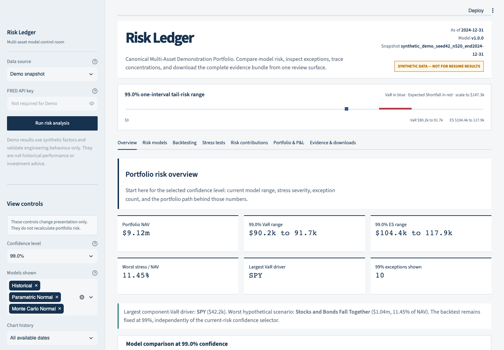
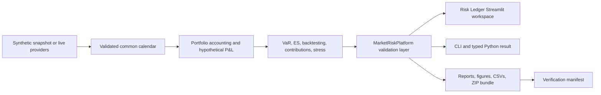

# Multi-Asset Market Risk Platform

[](https://github.com/sheeeeshba/market-risk-engine/actions/workflows/tests.yml)
[](https://github.com/sheeeeshba/market-risk-engine/releases)
[](https://www.python.org/)
[](https://streamlit.io/)
[](LICENSE)
[](https://colab.research.google.com/github/sheeeeshba/market-risk-engine/blob/main/notebooks/market_risk_engine_colab.ipynb)

An end-to-end Python market-risk platform that turns a configurable multi-asset portfolio into hypothetical P&L, VaR and Expected Shortfall, rolling backtests, stress losses, risk contributions, and downloadable management evidence.

The **Risk Ledger** workspace is built for review: clear navigation, consistent financial formatting, responsive charts, and controls for confidence level, models, time window, display units, USD versus `% of NAV`, and the number of risk drivers shown.

> **Evidence boundary:** the bundled Demo uses a deterministic synthetic snapshot. Its values prove that the engineering workflow runs reproducibly; they are not historical performance, investment results, or regulatory-model evidence.



## Two-Minute Reviewer Start

```bash
git clone https://github.com/sheeeeshba/market-risk-engine.git
cd market-risk-engine
python3 -m venv .venv
source .venv/bin/activate
python -m pip install ".[dev]"
python -m market_risk app
```

Open `http://localhost:8501`. The default Demo loads without credentials. No pipeline rerun is required to explore the committed evidence.

For VS Code users, open `market-risk-engine.code-workspace`, then run `Tasks: Run Task` → `Risk Engine: dashboard`.

## Interactive Review Workflow

The sidebar changes presentation without silently changing the underlying calculation:

| Control | What it changes |
|---|---|
| Confidence level | Current VaR/Expected Shortfall comparison and headline range |
| Models shown | Model comparison and rolling backtest series |
| Chart history | All dates, 12 months, 6 months, or 3 months |
| Money display | Automatic, USD, USD thousands, or USD millions |
| Risk chart basis | USD loss or percentage of portfolio NAV |
| Risk drivers shown | Number of component-VaR positions displayed |

Seven task-oriented tabs keep the analysis readable:

- **Overview** — NAV, selected VaR/ES ranges, stress severity, exceptions, and portfolio path.
- **Risk models** — grouped model comparison or configurable confidence curve.
- **Backtesting** — rolling 99% VaR, realized hypothetical loss, breaches, and test diagnostics.
- **Stress tests** — hypothetical scenarios, artificial crisis fixtures, and distributional stress.
- **Risk contributions** — position, asset-class, and factor decomposition.
- **Portfolio & P&L** — switchable NAV, daily P&L, and cumulative P&L charts plus closing holdings.
- **Evidence & downloads** — management report, one-page summary, complete ZIP, manifest, and figures.

## Quantitative Scope

- Canonical USD 10 million funded portfolio plus a separately accounted long-EUR overlay.
- Adjusted-return ETF P&L, duration-convexity bond P&L, direct EURUSD P&L, monthly self-financing rebalancing, and daily NAV reconciliation.
- Historical Simulation, linear Parametric Normal, and full-revaluation Monte Carlo VaR/ES at 95%, 97.5%, and 99%.
- Exact finite-sample Historical ES weights, including equal treatment of scenarios tied at the VaR boundary.
- Leak-free rolling 99% forecasts with Kupiec and Christoffersen tests and explicit low-power warnings.
- Position, asset-class, and factor views; additive Parametric component VaR and Historical ES contributions.
- Six hypothetical scenarios, three versioned artificial crisis fixtures, and volatility/correlation distribution stress.
- Versioned reports, eight generated figures, CSV evidence tables, configuration and snapshot hashes, and a verification manifest.

## Architecture



`MarketRiskPlatform.analyze()` is the compact application boundary. It either loads committed evidence or refreshes the full engine, validates required artifacts, and returns a typed `MarketRiskAnalysis` object consumed by the UI and download layer.

## Portfolio and Data

Funded target weights are SPY 20%, QQQ 10%, EFA 10%, GLD 5%, US 5Y bond 15%, US 10Y bond 15%, and USD cash 25%. They sum to 100% of NAV. A long-EUR/short-USD overlay has zero funded market value and a risk notional equal to 7.5% of post-rebalance NAV.

The repository includes a fixed 520-row artificial factor snapshot for offline verification. Optional live mode downloads ETF and EURUSD levels through `yfinance` and DGS5/DGS10 observations from FRED, then rebuilds the common calendar. Provider data are not bundled as a verified real-data snapshot.

## Financial Conventions

- Positive P&L is profit; loss is `-P&L`; VaR and ES are positive loss magnitudes.
- ETF P&L is signed book market value multiplied by adjusted simple return.
- Bond return is `-Modified Duration × ΔYield + 0.5 × Convexity × ΔYield²`, using decimal yield changes.
- FX P&L is signed USD-equivalent notional multiplied by EURUSD return, where EURUSD is USD per EUR.
- Every rolling forecast uses exactly 250 factor rows ending at close `t`, end-of-`t` holdings, and next-valid-date P&L at `t_next`.
- The core engine uses no square-root-of-time scaling.

See [Model Methodology](docs/MODEL_METHODOLOGY.md), [Validation Report](docs/VALIDATION_REPORT.md), and [Model Limitations](docs/MODEL_LIMITATIONS.md) for formulas, controls, and model-risk discussion.

## Command-Line Workflows

Run the complete deterministic pipeline:

```bash
python -m market_risk run --config config/model_config.yaml --data-mode snapshot
```

Recreate the artificial snapshot:

```bash
python -m market_risk make-synthetic-snapshot --periods 520 --seed 42
```

Optional live mode:

```bash
python -m pip install ".[live,dev]"
export FRED_API_KEY="your-session-key"
python -m market_risk run --config config/model_config.yaml --data-mode live
```

Live mode detects the latest common valid date. It does not hard-code a fake current date, and the application never writes a supplied FRED key to reports or downloads.

## Tests and Reproducibility

```bash
python -m ruff check .
MPLCONFIGDIR=.mplconfig python -m pytest --cov=market_risk --cov-report=term-missing
```

The current suite contains **28 passing tests**, including Streamlit application tests. It covers data alignment, P&L signs, funding and overlay accounting, Historical tail weights, Normal and Monte Carlo risk, contributions, scenario reconciliation, backtesting edge cases, look-ahead alignment, platform artifact validation, downloads, live-mode gating, and interactive view controls.

GitHub Actions repeats linting, tests, coverage reporting, and a CLI smoke test on Python 3.11 and 3.12. The generated manifest records the pipeline and quality-gate provenance; never infer a pass from this README alone after changing code or configuration.

## Repository Map

```text
streamlit_app.py          Interactive Risk Ledger workspace
src/market_risk/          Quant engine, platform interface, CLI, and models
tests/                    Financial-behaviour, integration, platform, and UI tests
config/                   Portfolio, model, scenario, and crisis configuration
data/snapshots/           Deterministic synthetic review fixture
outputs/                  Generated tables, figures, logs, and verification manifest
reports/generated/        Management report and one-page summary
docs/                     Methodology, validation, case study, interview, and CV material
```

## Verified Demonstration Scale

The committed artificial run processes 520 factor rows, produces 270 rolling forecasts per model, uses 50,000 paths for current Monte Carlo risk, tests convergence at up to 100,000 paths across three seeds, evaluates six hypothetical scenarios, and generates eight figures. These are engineering-scale facts, not historical-market findings.

## Limitations

- Bundled data are artificial and unsuitable for historical conclusions or resume performance metrics.
- ETFs are synthetic total-return holdings; transaction costs, fees, taxes, and trading slippage are omitted.
- Bonds are constant-sensitivity representations without coupon/carry, ageing, pull-to-par, or full cash-flow repricing.
- Cash earns zero and the FX overlay is treated as zero funded value with daily cash settlement.
- Normal covariance models miss skewness, fat tails, volatility dynamics, and parameter uncertainty.
- Historical 99% ES from 250 rows has only 2.5 effective tail observations.
- Statistical non-rejection in a low-power VaR backtest is not proof of model correctness.
- This educational model is not approved for regulatory capital, production limits, investment advice, or live trading.

## Portfolio and CV Material

- [Portfolio presentation pack](PORTFOLIO.md)
- [CV-ready project section](docs/CV_PROJECT_SECTION.md)
- [Project case study](docs/PROJECT_CASE_STUDY.md)
- [Interview guide](docs/INTERVIEW_GUIDE.md)
- [Russian setup guide](START_HERE_RU.md)
- [Deployment guide](DEPLOYMENT.md)

## Author / Contact

[sheeeeshba](https://github.com/sheeeeshba) — open to junior Market Risk, Portfolio Risk, Treasury Risk, Financial Risk, Quantitative Risk, and finance-oriented Data Analyst opportunities.
