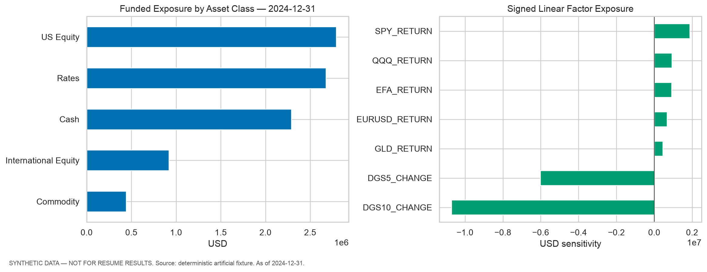
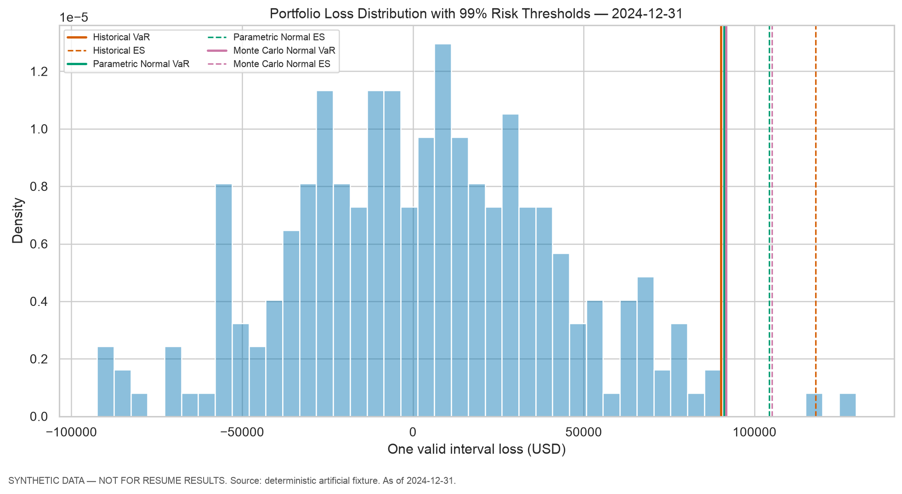
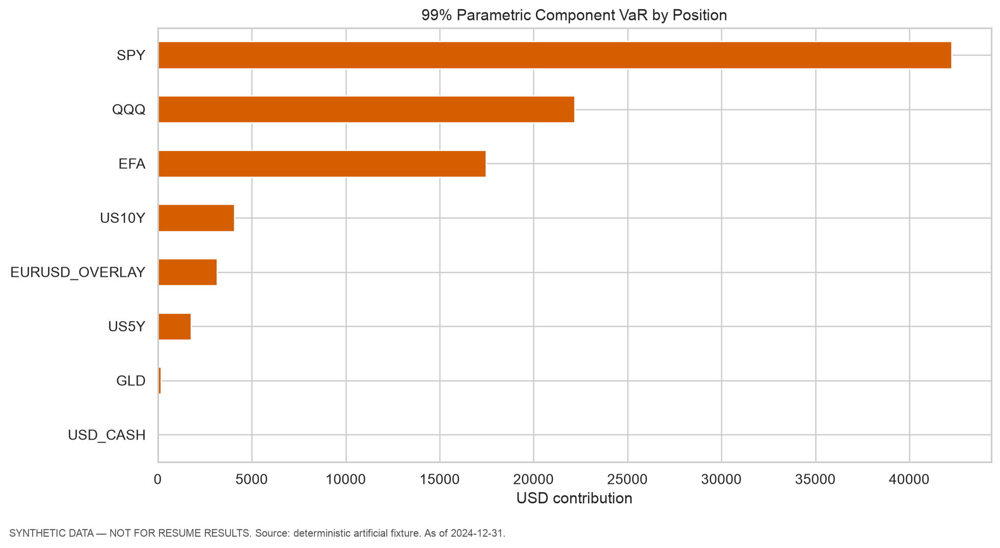
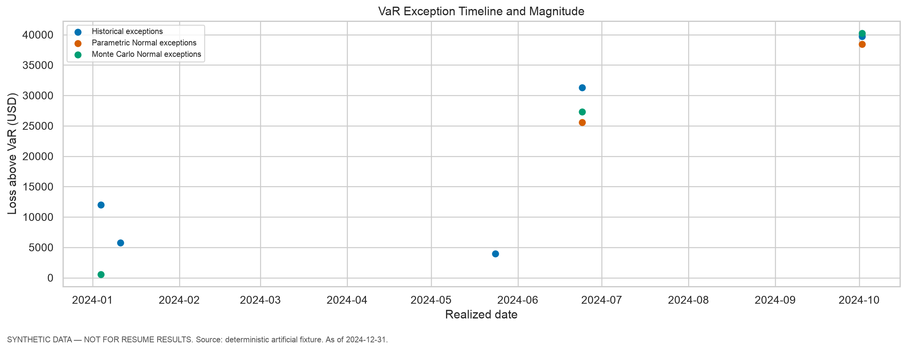
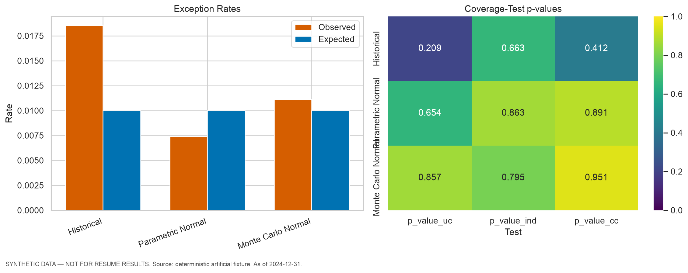
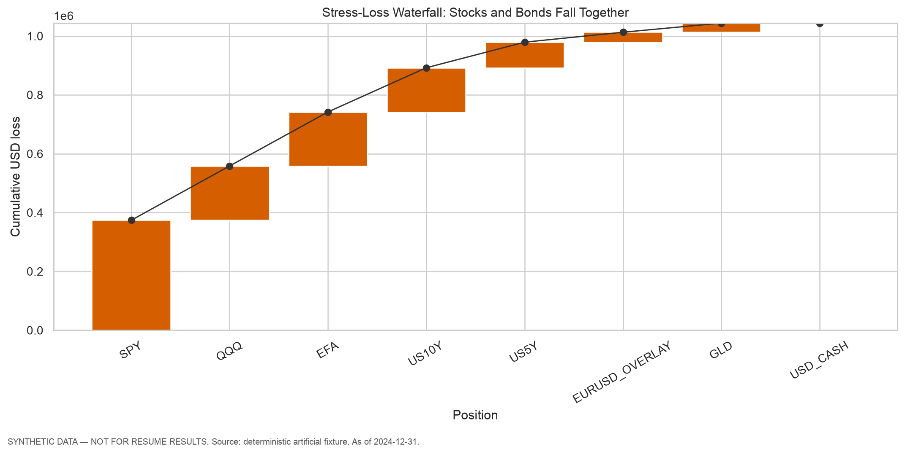
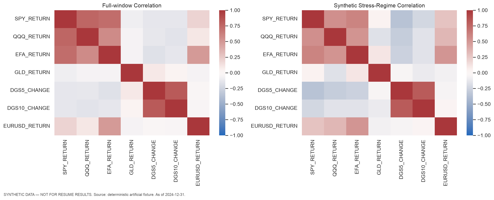

# Canonical Multi-Asset Demonstration Portfolio — Market Risk Report

> **SYNTHETIC DATA — NOT FOR RESUME RESULTS.** Educational model — not approved for regulatory capital or live trading limits.

| Governance field | Value |
|---|---|
| Valuation date | 2024-12-31 |
| Base currency | USD |
| Model version | 0.1.0 |
| Data source / snapshot | Deterministic artificial latent-factor generator / `synthetic_demo_seed42_n520_end2024-12-31` |
| Data retrieval or creation time | 2026-09-16T19:52:08.009712+00:00 |
| Lookback | 250 valid portfolio intervals |
| Confidence levels | 95.0%, 97.5%, 99.0% |
| Monte Carlo paths / seed | 50,000 / 42 |
| Configuration hash | `900987d7ab6c35daf81b40ec113925065d7122fc01a3bdb249e09deff743ed09` |
| Runtime | python 3.14.2, numpy 2.5.3, pandas 2.3.3, scipy 1.18.1, matplotlib 3.11.2 |
| Generated UTC | 2026-09-16T20:46:37.596624+00:00 |

## Executive Summary

- NAV: **USD 9,117,367**; gross funded exposure: **USD 9,117,367**; overlay notional: **USD 676,322**.
- Primary 99% VaR ranges from **USD 90,233** to **USD 91,731** across the three Core models.
- Primary 97.5% ES ranges from **USD 91,534** to **USD 97,676**.
- Largest Parametric component-VaR driver: **SPY** (USD 42,249).
- Worst configured deterministic stress: **Stocks and Bonds Fall Together**, loss **USD 1,043,993** (11.45% of NAV).
- Backtesting generated **270** leak-free next-interval forecasts per model; interpretation is subject to the warnings below.

## Portfolio and Sensitivities

| position_id    | instrument_type   | asset_class          | factor        | market_value   | notional    |
|:---------------|:------------------|:---------------------|:--------------|:---------------|:------------|
| SPY            | etf               | US Equity            | SPY_RETURN    | USD 1,869,802  | USD 0       |
| QQQ            | etf               | US Equity            | QQQ_RETURN    | USD 922,031    | USD 0       |
| EFA            | etf               | International Equity | EFA_RETURN    | USD 918,287    | USD 0       |
| GLD            | etf               | Commodity            | GLD_RETURN    | USD 442,435    | USD 0       |
| US5Y           | bond              | Rates                | DGS5_CHANGE   | USD 1,336,835  | USD 0       |
| US10Y          | bond              | Rates                | DGS10_CHANGE  | USD 1,340,067  | USD 0       |
| USD_CASH       | cash              | Cash                 | CASH_RETURN   | USD 2,287,909  | USD 0       |
| EURUSD_OVERLAY | fx_forward        | FX                   | EURUSD_RETURN | USD 0          | USD 676,322 |

Total signed DV01 reports the approximate loss for a +1 bp parallel yield move: **USD 1,674**. A positive DV01 is a loss sensitivity for the long positive-duration Core bond book.

## Current VaR and Expected Shortfall

|                               | var        | es          | var_pct_nav   | es_pct_nav   |
|:------------------------------|:-----------|:------------|:--------------|:-------------|
| ('Historical', 0.95)          | USD 69,585 | USD 85,822  | 0.76%         | 0.94%        |
| ('Parametric Normal', 0.95)   | USD 64,403 | USD 80,763  | 0.71%         | 0.89%        |
| ('Monte Carlo Normal', 0.95)  | USD 64,203 | USD 80,957  | 0.70%         | 0.89%        |
| ('Historical', 0.975)         | USD 76,566 | USD 97,676  | 0.84%         | 1.07%        |
| ('Parametric Normal', 0.975)  | USD 76,740 | USD 91,534  | 0.84%         | 1.00%        |
| ('Monte Carlo Normal', 0.975) | USD 76,849 | USD 92,154  | 0.84%         | 1.01%        |
| ('Historical', 0.99)          | USD 90,233 | USD 117,880 | 0.99%         | 1.29%        |
| ('Parametric Normal', 0.99)   | USD 91,086 | USD 104,354 | 1.00%         | 1.14%        |
| ('Monte Carlo Normal', 0.99)  | USD 91,731 | USD 105,091 | 1.01%         | 1.15%        |

Historical ES uses exactly 6.25 effective observations at the primary ES confidence. Small effective tail mass makes the estimate unstable; 99% ES from 250 observations would use only 2.5 effective observations.

### Monte Carlo Convergence

|   seed | var_50k_vs_100k_abs_pct   | es_50k_vs_100k_abs_pct   | var_target_below_2pct   |
|-------:|:--------------------------|:-------------------------|:------------------------|
|     42 | 0.38%                     | 0.50%                    | True                    |
|    314 | 0.01%                     | 0.24%                    | True                    |
|   2026 | 0.83%                     | 1.05%                    | True                    |

The maximum absolute 50,000-versus-100,000-path difference across three seeds is 0.83% for 99% VaR and 1.05% for ES. The approximate 2% VaR convergence target is evaluated per seed in the table.

## Risk Contributions

| position_id    | component_var   | historical_es_contribution   | asset_class          | factor        |
|:---------------|:----------------|:-----------------------------|:---------------------|:--------------|
| SPY            | USD 42,249      | USD 43,232                   | US Equity            | SPY_RETURN    |
| QQQ            | USD 22,183      | USD 24,367                   | US Equity            | QQQ_RETURN    |
| EFA            | USD 17,465      | USD 20,594                   | International Equity | EFA_RETURN    |
| GLD            | USD 184         | USD -1,247                   | Commodity            | GLD_RETURN    |
| US5Y           | USD 1,776       | USD 2,853                    | Rates                | DGS5_CHANGE   |
| US10Y          | USD 4,080       | USD 4,416                    | Rates                | DGS10_CHANGE  |
| USD_CASH       | USD 0           | USD 0                        | Cash                 | CASH_RETURN   |
| EURUSD_OVERLAY | USD 3,148       | USD 3,461                    | FX                   | EURUSD_RETURN |

The position contributions reconcile to total Parametric VaR. Negative contributions are retained as genuine diversification or hedge effects.

Top-three component-VaR concentration is **89.91%**. Negative primary Parametric contributions: **None in the primary Parametric decomposition**.

### Asset-Class Contributions

| asset_class          | component_var   | historical_es_contribution   |
|:---------------------|:----------------|:-----------------------------|
| US Equity            | USD 64,432      | USD 67,600                   |
| International Equity | USD 17,465      | USD 20,594                   |
| Commodity            | USD 184         | USD -1,247                   |
| Rates                | USD 5,856       | USD 7,269                    |
| Cash                 | USD 0           | USD 0                        |
| FX                   | USD 3,148       | USD 3,461                    |

### Factor Contributions

| factor        | exposure        | component_var   | historical_es_contribution   |
|:--------------|:----------------|:----------------|:-----------------------------|
| SPY_RETURN    | USD 1,869,802   | USD 42,249      | USD 43,232                   |
| QQQ_RETURN    | USD 922,031     | USD 22,183      | USD 24,367                   |
| EFA_RETURN    | USD 918,287     | USD 17,465      | USD 20,594                   |
| GLD_RETURN    | USD 442,435     | USD 184         | USD -1,247                   |
| DGS5_CHANGE   | USD -6,015,756  | USD 1,776       | USD 2,853                    |
| DGS10_CHANGE  | USD -10,720,535 | USD 4,080       | USD 4,416                    |
| EURUSD_RETURN | USD 676,322     | USD 3,148       | USD 3,461                    |

## Rolling Forecasts and Backtesting

|                              |   forecasts |   exceptions |   expected_exceptions |   p_value_uc |   p_value_ind |   p_value_cc |
|:-----------------------------|------------:|-------------:|----------------------:|-------------:|--------------:|-------------:|
| ('Historical', 0.99)         |         270 |            5 |                   2.7 |        0.209 |         0.663 |        0.412 |
| ('Parametric Normal', 0.99)  |         270 |            2 |                   2.7 |        0.654 |         0.863 |        0.891 |
| ('Monte Carlo Normal', 0.99) |         270 |            3 |                   2.7 |        0.857 |         0.795 |        0.951 |

Statistical non-rejection does not prove model correctness. Kupiec tests unconditional coverage; Christoffersen tests exception independence. This project does not claim a complete regulatory ES backtest.

- Warning: `LOW_POWER_FEWER_THAN_5_EXPECTED_EXCEPTIONS`
- Warning: `UNSTABLE_TRANSITION_COUNTS`

## Hypothetical Stress Tests

| scenario_id                   | scenario_name                                | scenario_loss   | loss_pct_nav   | principal_loss_driver   |
|:------------------------------|:---------------------------------------------|:----------------|:---------------|:------------------------|
| global_equity_selloff         | Global Equity Selloff                        | USD 732,964     | 8.04%          | SPY                     |
| parallel_rates_up_100bp       | Parallel Rates +100 bps                      | USD 161,202     | 1.77%          | US10Y                   |
| parallel_rates_up_200bp       | Parallel Rates +200 bps                      | USD 310,083     | 3.40%          | US10Y                   |
| foreign_currencies_down_10pct | Foreign Currencies Depreciate 10% versus USD | USD 67,632      | 0.74%          | EURUSD_OVERLAY          |
| stocks_and_bonds_fall         | Stocks and Bonds Fall Together               | USD 1,043,993   | 11.45%         | SPY                     |
| flight_to_quality             | Flight to Quality                            | USD 580,448     | 6.37%          | SPY                     |

Scenario gains remain negative losses; they are not floored to zero. ETF shocks apply to USD-listed total-return factors, and EURUSD shocks apply only to the direct FX overlay.

## Historical-Crisis Replay Archive

| scenario_id                    | scenario_name                                   | horizon                            | scenario_loss   | loss_pct_nav   |
|:-------------------------------|:------------------------------------------------|:-----------------------------------|:----------------|:---------------|
| gfc_lehman_synthetic           | GFC / Lehman Window (Artificial Fixture)        | 2008-09-15_to_2008-10-10_multi_day | USD 1,023,284   | 11.22%         |
| covid_2020_synthetic           | COVID-19 Window (Artificial Fixture)            | 2020-02-19_to_2020-03-23_multi_day | USD 1,103,338   | 12.10%         |
| inflation_rates_2022_synthetic | Inflation and Rates Window (Artificial Fixture) | 2022-01-03_to_2022-10-12_multi_day | USD 1,596,235   | 17.51%         |

These are multi-day scenario replays and are not comparable horizons to the one-valid-interval VaR. The archive currently contains artificial shocks only and cannot be described as observed crisis performance.
## Volatility and Correlation Stress

|   volatility_scale | immediate_pnl   | parametric_var   | parametric_increase   | monte_carlo_var   | monte_carlo_es   |
|-------------------:|:----------------|:-----------------|:----------------------|:------------------|:-----------------|
|                1.5 | USD 0           | USD 135,539      | 48.80%                | USD 134,493       | USD 154,325      |
|                2   | USD 0           | USD 180,718      | 98.40%                | USD 179,316       | USD 205,739      |

A pure volatility change creates no immediate deterministic P&L for this Core portfolio. It changes the distribution used to estimate VaR and ES.

## Data Quality and Controls

- Required ETF and FX factors are never forward-filled or silently replaced with zero.
- Treasury forward-fill is limited to three business days and exposed through quality flags.
- Position P&L reconciles to portfolio P&L, and funded holdings reconcile to NAV.
- Forecast windows end on the forecast date; realized P&L is the next valid portfolio interval.
- Random seeds, configuration hash, snapshot ID, runtime versions, and generated files are recorded.

## Assumptions and Limitations

- Core ETFs are synthetic adjusted-total-return holdings; fees, taxes, and trading costs are omitted.
- Bonds use constant duration and convexity, with no coupon/carry, pull-to-par, or daily sensitivity ageing.
- Cash earns zero; the FX overlay is zero funded value and settles daily P&L into cash.
- Normal Parametric and Monte Carlo models assume stable covariance and do not capture skewness or fat tails.
- Historical estimates depend on a short 250-observation window and sparse tail mass.
- No square-root-of-time scaling is used; one day means one valid common valuation interval.
- All numerical results in this report are engineering demonstrations on artificial data and are blocked from resume claims.
